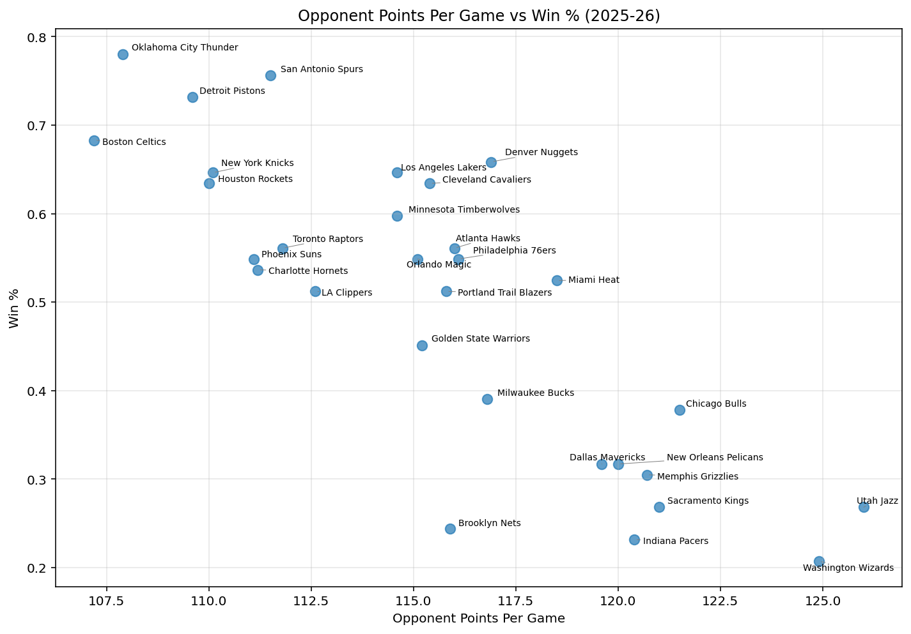
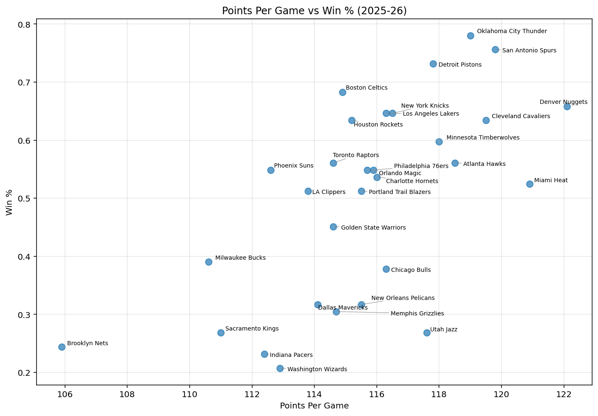
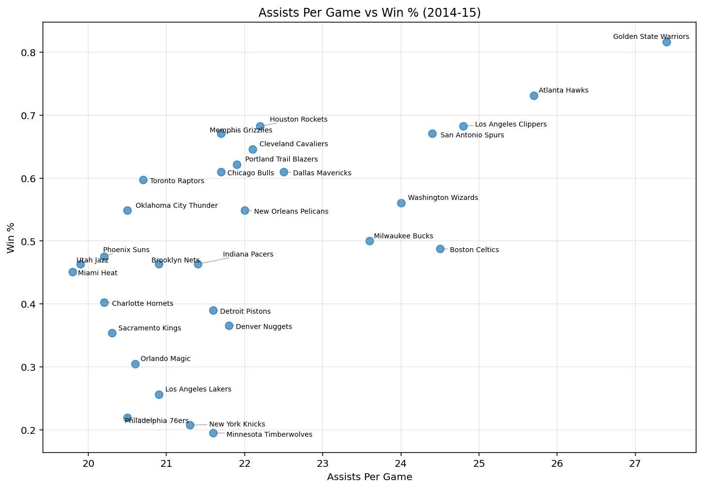
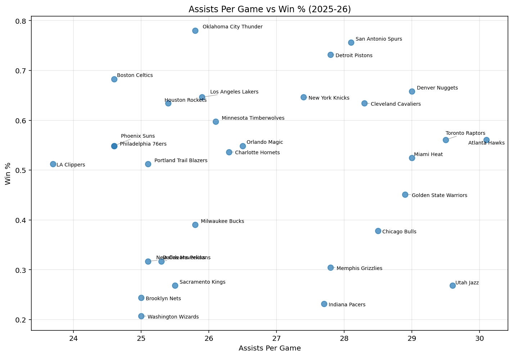

# What Actually Predicts Winning in the NBA?

**A 16-season statistical analysis, 2010-11 through 2025-26**

Which team-level box score statistics are actually tied to winning in the NBA? This project tests common basketball intuitions ("scoring matters," "defense wins championships," "ball movement wins games") against 16 seasons of data from the NBA's official stats API, and checks whether those relationships hold up consistently across a league that has changed substantially in style of play.

---

## Data & Methodology

- **Source:** [`nba_api`](https://github.com/swar/nba_api) (Python), pulling the NBA's official `LeagueDashTeamStats` endpoint, using per-game averages from the `Base` and `Opponent` measure types.
- **Scope:** All 30 teams × 16 seasons (2010-11 through 2025-26) = **480 team-seasons**.
- **Outcome variable:** Win percentage, `W / (W + L)`, used instead of raw win totals so seasons of differing length stay comparable.
- **Metrics:** Points, opponent points allowed, assists, offensive/defensive rebounds, steals, blocks, blocks against, turnovers, turnovers forced, FG% / 3P% / FT%, and shot volume (FGA, 3PA).
- **Tools:** Python (pandas, statsmodels, matplotlib), `nba_api`, Spyder.

The analysis runs in four stages: single-stat correlations tracked season by season, a multiple regression combining all stats at once, a rank profile of every champion in the period, and a threshold filter testing whether a "championship profile" can be isolated statistically.

---

## Finding 1: Shooting efficiency predicts winning best, the opponent's most of all

Each stat was correlated against win percentage *separately for every season*, which separates durable signal from one-year noise. Two things matter for judging a stat: how strong it is on average, and whether it ever flips sign.

Ranked by average absolute correlation across all 16 seasons:

| Stat | Mean r | Range | Same sign all 16 seasons |
|---|---|---|---|
| Opponent FG% | **-0.708** | -0.87 to -0.51 | Yes |
| FG% | **0.672** | 0.58 to 0.75 | Yes |
| PTS | 0.608 | 0.32 to 0.75 | Yes |
| Opponent PTS | -0.608 | -0.83 to -0.48 | Yes |
| 3P% | 0.598 | 0.42 to 0.86 | Yes |
| Blocks against | -0.511 | -0.75 to -0.28 | Yes |
| FGM | 0.495 | 0.14 to 0.68 | Yes |
| DREB | 0.485 | 0.22 to 0.67 | Yes |
| TOV | -0.337 | -0.68 to -0.02 | Yes |
| AST | 0.319 | 0.09 to 0.62 | Yes |
| Opponent TOV | 0.074 | -0.26 to 0.35 | No |
| FGA | -0.094 | -0.48 to 0.23 | No |
| OREB | -0.125 | -0.47 to 0.21 | No |

**The two strongest stats in the dataset are the same measurement pointed in opposite directions**: how well you shoot, and how well you let the other team shoot. Opponent FG% leads everything at -0.708, and it never once flipped sign in 16 seasons. The two are also statistically independent of each other (r = 0.009 across all 480 team-seasons), so they aren't two views of the same underlying quality: being good at scoring efficiently tells you nothing about being good at preventing it, and each carries real information the other doesn't. The strongest single predictor in the whole dataset being a defensive stat shows that defense is a big and genuinely useful part of winning. It does not mean defense is the only thing that matters, since own FG% sits right behind it at 0.672 and offense is obviously still required.

The 2025-26 season shows the defensive relationship about as cleanly as it ever appears. Points allowed correlated at -0.83 that year, and the downward slope is visible without any statistics at all:

Oklahoma City, San Antonio, Detroit and Boston sit in the top left, giving up the fewest points and winning the most. Utah and Washington sit at the bottom right. The scatter around that trend is what separates a correlation of -0.83 from a perfect -1.0.

The same season's scoring plot is looser, which is what a correlation of 0.63 looks like next to one of -0.83:

Denver scored the most in the league and won 66% of its games; Milwaukee scored the least and won 39%. The trend is real but the band is wide, and Utah at 117.6 points with a 27% win rate is the kind of team that keeps the relationship from being tighter.

**Points scored and points allowed are dead even**: both average 0.608. Raw scoring on offense and defense carry identical predictive weight. Any claim that one side of the ball matters more than the other doesn't survive the 16-season average, even though individual seasons can look lopsided (2025-26 had opponent points at -0.83 against own points at 0.63).

**Efficiency beats volume, decisively.** Compare the percentage stats to the attempt stats:

| | Mean r |
|---|---|
| FG% | 0.672 |
| FGA (attempts) | -0.094 |
| 3P% | 0.598 |
| 3PA (attempts) | 0.204 |

Shooting *well* is among the strongest signals in the data; shooting *often* is statistically close to meaningless, and FGA doesn't even hold a consistent sign. Teams don't win by taking more shots.

**Offensive rebounding trends negative.** OREB averages -0.125, plausibly because missing shots is a prerequisite for rebounding them, so high OREB partly indexes bad shooting.

### Blocks against: the most surprising result in the data

Blocks against (BLKA), meaning how often a team's own shots get blocked, averages **-0.511**, negative in all 16 seasons. It outranks turnovers (-0.337), assists (0.319), and defensive rebounding (0.485). How often your shots get swatted says more about your team than how often you lose the ball does.

What makes it stranger is the asymmetry with its mirror image:

| | Mean r | Same sign all 16 |
|---|---|---|
| Blocks against (your shots blocked) | **-0.511** | Yes |
| Blocks (you blocking them) | 0.246 | **No** |

**Getting blocked predicts losing roughly twice as strongly as blocking predicts winning**, and BLK is one of the few stats in the dataset that flips sign at all: it went negative in 2021-22. Rim protection as a defensive skill is weak and inconsistent as a win signal; having your own shot contested at the rim is strong and consistent.

**A hypothesis, and a test.** BLKA plausibly isn't measuring the opponent's rim protection at all: it's measuring your own shot selection. NBA schedules are roughly balanced, so every team faces a similar mix of defenses; a persistently high BLKA therefore reflects your own team repeatedly driving into help, taking contested interior shots, or lacking the spacing to avoid them. If that's right, teams with high BLKA should shoot worse *overall*, not just on the blocked attempts.

Testing it against all 480 team-seasons:

| Link | r |
|---|---|
| BLKA ↔ FG% | **-0.464** (negative in all 16 seasons, range -0.20 to -0.57) |
| FG% ↔ Win% | 0.672 |
| BLKA ↔ Win% | -0.511 |

The chain holds at every link, which supports reading BLKA as a shot-quality indicator wearing a defensive-stat costume.

**One confound worth naming:** a blocked shot *is* a missed field goal attempt, so BLKA is mechanically folded into FG%, which makes some of that -0.464 definitional rather than behavioral. But blocks account for only about 5% of a team's attempts, so a correlation of -0.46 is much larger than the arithmetic alone would produce. The excess is the actual finding: getting blocked travels with missing the shots you *weren't* blocked on.

### Season-by-season detail

| Season | Opp FG% | FG% | PTS | Opp PTS | 3P% | AST | TOV | DREB |
|---|---|---|---|---|---|---|---|---|
| 2010-11 | -0.71 | 0.69 | 0.32 | -0.67 | 0.42 | 0.32 | -0.48 | 0.50 |
| 2011-12 | -0.67 | 0.73 | 0.63 | -0.55 | 0.57 | 0.32 | -0.17 | 0.67 |
| 2012-13 | -0.72 | 0.72 | 0.62 | -0.54 | 0.53 | 0.30 | -0.02 | 0.39 |
| 2013-14 | -0.72 | 0.67 | 0.52 | -0.58 | 0.53 | 0.32 | -0.24 | 0.49 |
| 2014-15 | -0.67 | 0.75 | 0.75 | -0.51 | 0.69 | 0.62 | -0.26 | 0.46 |
| 2015-16 | -0.79 | 0.65 | 0.68 | -0.66 | 0.64 | 0.42 | -0.36 | 0.62 |
| 2016-17 | -0.60 | 0.67 | 0.51 | -0.52 | 0.64 | 0.46 | -0.21 | 0.22 |
| 2017-18 | -0.51 | 0.65 | 0.70 | -0.48 | 0.49 | 0.25 | -0.14 | 0.34 |
| 2018-19 | -0.71 | 0.61 | 0.66 | -0.54 | 0.54 | 0.50 | -0.25 | 0.57 |
| 2019-20 | -0.85 | 0.67 | 0.56 | -0.67 | 0.45 | 0.13 | -0.28 | 0.65 |
| 2020-21 | -0.67 | 0.75 | 0.67 | -0.55 | 0.79 | 0.20 | -0.36 | 0.47 |
| 2021-22 | -0.65 | 0.62 | 0.59 | -0.68 | 0.69 | 0.35 | -0.46 | 0.45 |
| 2022-23 | -0.63 | 0.58 | 0.54 | -0.67 | 0.61 | 0.36 | -0.40 | 0.40 |
| 2023-24 | -0.79 | 0.69 | 0.61 | -0.66 | **0.86** | 0.16 | -0.60 | 0.57 |
| 2024-25 | -0.76 | 0.67 | 0.73 | -0.61 | 0.67 | 0.30 | -0.68 | 0.46 |
| 2025-26 | **-0.87** | 0.63 | 0.63 | -0.83 | 0.44 | 0.09 | -0.50 | 0.51 |

### Assists: a description of style, not a requirement

Assists average a modest 0.319, positive in all 16 seasons but with the widest swing of any stat that never flips sign: 0.62 in 2014-15 down to 0.09 in 2025-26.

Those two endpoints line up with how the league was actually built in each year. 2014-15 is the ball-movement Warriors, an offense whose whole identity was passing the defense into mistakes. 2025-26 sits at the other extreme, an isolation era built around elite one-on-one shot creators like Shai Gilgeous-Alexander and Jalen Brunson, where a possession ending in a made basket often involves no pass at all and so records no assist.

Plotting both seasons side by side makes the difference obvious. In 2014-15 the relationship is clear, with Golden State out at the top right on 27.4 assists and an 81.7% win rate:

In 2025-26 the same plot is essentially a cloud. Utah ranks near the top of the league in assists and won 27% of its games; Oklahoma City sits mid-pack in assists and won 78%:

Both eras won. That's the useful takeaway: **assist volume isn't a requirement for winning, it's a description of style.** A team can generate efficient shots through passing or through isolation talent, and the data has no strong preference between them, which is also why assists rank well below the shooting-efficiency stats. What correlates with winning is the quality of the shot, not the number of passes that preceded it.

---

## Finding 2: Together these stats explain 94–98% of win percentage, with a caveat

Single-stat correlations overlap with each other (a team's PTS and FG% aren't independent), so a multiple regression was run per season to measure how much all 12 stats explain *together*, and what each contributes once the others are accounted for.

| Season | R² | PTS coef. | OPP_PTS coef. | FG% coef. | 3P% coef. |
|---|---|---|---|---|---|
| 2010-11 | 0.970 | 0.028 | -0.032 | 0.575 | 0.222 |
| 2011-12 | 0.940 | 0.036 | -0.035 | -0.205 | -0.247 |
| 2012-13 | 0.956 | 0.030 | -0.032 | 0.442 | 0.699 |
| 2013-14 | 0.950 | 0.028 | -0.031 | 0.496 | 0.240 |
| 2014-15 | 0.970 | 0.035 | -0.036 | 0.016 | -0.501 |
| 2015-16 | 0.973 | 0.028 | -0.027 | 0.565 | 0.901 |
| 2016-17 | 0.946 | 0.030 | -0.033 | -0.474 | 0.683 |
| 2017-18 | 0.945 | 0.028 | -0.025 | 2.134 | 0.857 |
| 2018-19 | 0.979 | 0.029 | -0.030 | 0.513 | 0.943 |
| 2019-20 | 0.949 | 0.023 | -0.031 | 1.757 | -0.658 |
| 2020-21 | 0.962 | 0.001 | -0.009 | 3.633 | 0.941 |
| 2021-22 | 0.953 | 0.016 | -0.023 | 3.082 | 0.400 |
| 2022-23 | 0.939 | 0.024 | -0.025 | 0.135 | 0.027 |
| 2023-24 | 0.971 | 0.027 | -0.028 | 0.670 | 0.321 |
| 2024-25 | 0.972 | 0.030 | -0.027 | -0.195 | -0.660 |
| 2025-26 | 0.970 | 0.037 | -0.030 | 0.473 | -1.373 |

R² held between 0.94 and 0.98 in every season, which is unsurprising since box score stats are close to a full decomposition of the final score itself.

**The more interesting result is what the coefficients reveal about model reliability.** `OPP_PTS` stayed negative and stable across all 16 seasons. `FG3_PCT` swung from +0.94 (2018-19) to -1.37 (2025-26), which is not a real reversal in the value of 3-point shooting but a signature of overfitting: 30 teams per season against 12 correlated predictors is too little data to cleanly attribute credit. The R² and the stability of `OPP_PTS` are the trustworthy takeaways here; individual season-by-season coefficients are not.

---

## Finding 3: What profile do champions actually share?

Every champion from 2010-11 to 2025-26, ranked 1–30 against the league in their title season:

| Season | Champion | FG% | Opp FG% | PTS | Opp PTS | 3P% | DREB | AST |
|---|---|---|---|---|---|---|---|---|
| 2010-11 | Dallas Mavericks | 4 | 8 | 11 | 10 | 11 | 6 | 1 |
| 2011-12 | Miami Heat | 4 | 5 | 7 | 4 | 9 | 12 | 20 |
| 2012-13 | Miami Heat | 1 | 5 | 5 | 5 | 2 | 15 | 7 |
| 2013-14 | San Antonio Spurs | 2 | 8 | 6 | 6 | 1 | 4 | 1 |
| 2014-15 | Golden State Warriors | 1 | 1 | 1 | 15 | 1 | 4 | 1 |
| 2015-16 | Cleveland Cavaliers | 9 | 14 | 8 | 4 | 7 | 10 | 13 |
| 2016-17 | Golden State Warriors | 1 | 1 | 1 | 11 | 3 | 3 | 1 |
| 2017-18 | Golden State Warriors | 1 | 3 | 1 | 18 | 1 | 6 | 1 |
| 2018-19 | Toronto Raptors | 5 | 5 | 8 | 9 | 6 | 9 | 13 |
| 2019-20 | Los Angeles Lakers | 1 | 7 | 11 | 4 | 21 | 12 | 10 |
| 2020-21 | Milwaukee Bucks | 3 | 5 | 1 | 22 | 4 | 1 | 13 |
| 2021-22 | Golden State Warriors | 9 | 2 | 15 | 3 | 8 | 2 | 5 |
| 2022-23 | Denver Nuggets | 1 | 20 | 12 | 9 | 4 | 16 | 2 |
| 2023-24 | Boston Celtics | 7 | 2 | 2 | 5 | 2 | 1 | 14 |
| 2024-25 | Oklahoma City Thunder | 6 | 1 | 4 | 3 | 6 | 5 | 12 |
| 2025-26 | New York Knicks | 11 | 5 | 10 | 5 | 4 | 11 | 13 |

Average rank tells you less here than *spread* does. A stat where champions cluster tightly is something a title team apparently has to have; a stat where they scatter is something a title team can win without.

| Stat | Average champion rank | Range across 16 champions |
|---|---|---|
| FG% | **4.1** | **1st – 11th** |
| 3P% | 5.6 | 1st – 21st |
| Opponent FG% | 5.8 | 1st – 20th |
| PTS | 6.4 | 1st – 15th |
| DREB | 7.3 | 1st – 16th |
| AST | 7.9 | 1st – 20th |
| Opponent PTS | 8.3 | 3rd – 22nd |

**Own shooting efficiency is the only thing champions are reliably elite at.** FG% has both the best average rank and by far the narrowest band: no champion in 16 years ranked worse than 11th. Every other stat has at least one champion sitting outside the top 15.

This doesn't contradict Finding 1; it answers a different question. Finding 1 asked which stat best separates winners from losers across all 30 teams in a season, and opponent FG% won. This asks which stat champions are most *consistently* elite at, and own FG% wins. A stat can be the better league-wide predictor while still being something a title team can get away with being merely good at: opponent FG% among champions ranges from 1st all the way to 20th (the 2022-23 Nuggets).

Other stats vary widely. The 2019-20 Lakers won ranking 21st in 3-point percentage. Four champions (2011-12 Heat, 2018-19 Raptors, 2020-21 Bucks, 2023-24 Celtics) ranked outside the top 10 in assists. Champions have reached a title through a lot of different statistical routes, but never through one that involved shooting the ball badly.

The wide ranges come with a catch, though, and the next section is the reason raw spread can mislead: a stat can look negotiable on its own while still being part of a condition a champion has to satisfy.

### Elite defense or the league's best offense, but never neither

Points allowed looks like the most negotiable stat in the table until you check *which* champions were bad at it. It turns out the exceptions aren't random:

- **12 of 16 champions ranked top-10 in points allowed.**
- **The other 4 all ranked 1st in the league in scoring**: the 2014-15, 2016-17 and 2017-18 Warriors, and the 2020-21 Bucks. All four were also 1st in field goals made.
- **No champion in 16 years was outside the top 10 defensively *and* short of the league's best offense.** Not one.

| Champion | Opp PTS rank | PTS rank |
|---|---|---|
| 2014-15 Golden State Warriors | 15 | **1** |
| 2016-17 Golden State Warriors | 11 | **1** |
| 2017-18 Golden State Warriors | 18 | **1** |
| 2020-21 Milwaukee Bucks | 22 | **1** |

So this isn't a case of defense being optional; it's a case of there being **two viable routes to a title, and a team needing one of them.** Either you defend at an elite level, or you field the single most productive offense in the league. Teams that were merely good at both never won.

That is a sharper version of Finding 1's conclusion. Defense is a substantial and reliable path to winning, and offense can substitute for it, but only at the very top end. Being 11th in points allowed and 8th in scoring has never been enough.

---

## Finding 4: Isolating a "championship profile"

As a final test, a filter was built from the loosest thresholds that still captured every champion in the dataset: top-15 in points, top-15 in blocks against, top-12 in shooting efficiency, and either elite 3-point shooting or elite defense.

Applied to all 480 team-seasons, it surfaced **all 16 champions and exactly one other team**: the 2015-16 Golden State Warriors, the 73-9 team that lost in the Finals.

| Season | Team | Result |
|---|---|---|
| 2010-11 | Dallas Mavericks | Champion |
| 2011-12 | Miami Heat | Champion |
| 2012-13 | Miami Heat | Champion |
| 2013-14 | San Antonio Spurs | Champion |
| 2014-15 | Golden State Warriors | Champion |
| 2015-16 | Cleveland Cavaliers | Champion |
| 2015-16 | Golden State Warriors | Runner-up (73-9 season) |
| 2016-17 | Golden State Warriors | Champion |
| 2017-18 | Golden State Warriors | Champion |
| 2018-19 | Toronto Raptors | Champion |
| 2019-20 | Los Angeles Lakers | Champion |
| 2020-21 | Milwaukee Bucks | Champion |
| 2021-22 | Golden State Warriors | Champion |
| 2022-23 | Denver Nuggets | Champion |
| 2023-24 | Boston Celtics | Champion |
| 2024-25 | Oklahoma City Thunder | Champion |
| 2025-26 | New York Knicks | Champion |

The filter's only "false positive" was arguably the most dominant regular-season team in NBA history, which is closer to a validation than a flaw, since it suggests the thresholds capture a genuine championship-caliber profile rather than simply memorizing the 16 teams that won.

---

## Limitations

- **The game keeps changing.** Teams adapt every year, and the league looks meaningfully different in 2025-26 than it did in 2010-11. These patterns describe how games have been won so far, not a fixed rule; a team can always find a new way to win that this data has never seen.
- **Per-game totals are pace-contaminated.** Points are measured per game rather than per possession, so fast-playing teams post higher numbers on both ends regardless of quality: PTS and opponent PTS correlate at 0.789.
- **The championship filter is tuned to its own sample.** It was built from the champions' own worst historical ranks, so its predictive value on future seasons is untested.
- **Regular season ≠ playoffs.** Championships are decided in a format this data doesn't cover.

---

## Conclusion

Across 16 seasons and 480 team-seasons, the data points consistently in one direction: **shooting efficiency on both ends of the floor is the most reliable statistical hallmark of winning teams and champions.** Opponent FG% (-0.708) and own FG% (0.672) are the two strongest relationships in the dataset, neither flipped sign once in 16 years, and the two are statistically independent of each other, so they measure genuinely separate skills rather than one underlying "good team" quality. Shot volume is close to meaningless by comparison, and raw points scored and allowed carry identical weight rather than one outranking the other.

Three more specific results came out of it:

- **Champions need elite defense or the league's best offense, never neither.** 12 of 16 champions ranked top-10 in points allowed; the other 4 all ranked 1st in scoring. No champion in 16 years was outside the top 10 defensively while also falling short of the league's best offense. There are two routes to a title, and a team has to take one of them.
- **Getting your shots blocked predicts losing about twice as strongly as blocking predicts winning.** Blocks against (-0.511) outranks turnovers, assists and rebounding, and correlates with shooting worse overall (-0.464): it appears to work as a shot-quality indicator rather than a measure of the opponent's rim protection.
- **Assist volume describes style, not quality.** The ball-movement era and the isolation era both produced champions, and the stat swings from 0.62 to 0.09 across those extremes.

That these held across a league that changed substantially in pace and 3-point volume since 2010 suggests they reflect something fairly fundamental about how basketball games are won, rather than a trend specific to one era.

